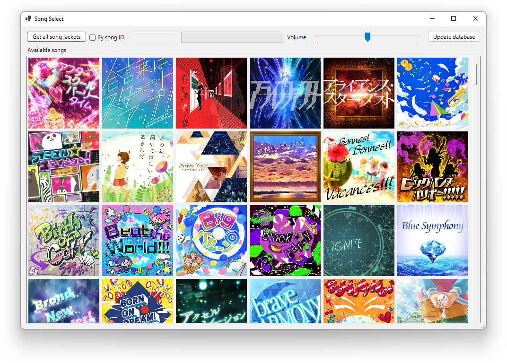
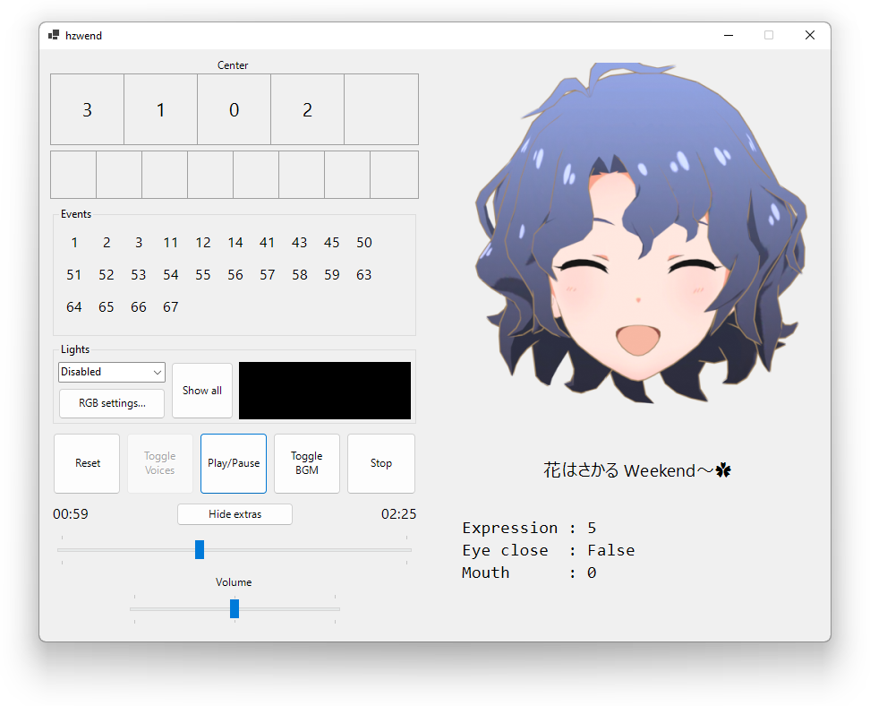

# ミリシタ Music Player

Music player for THE iDOLM@STER Million Live! Theater Days (アイドルマスター ミリオンライブ！ シアターデイズ).

Plays songs directly from the game assets via [AssetStudio](https://github.com/Perfare/AssetStudio).
Supports per-idol singing (歌い分け / utaiwake) songs.



## Usage
The program can be launched directly or via the command line:
```
MirishitaMusicPlayer.exe [song ID]
```
...where the song ID is the six-character song ID of the song you wish to play.

## Faces
When extras are shown in the player, there is a visualizer for lipsync and expressions.


You can set the face by adding a `face.zip` in the program's directory.
Example faces can be found [here](https://mega.nz/folder/4RYxlYja#naA1Ojt0Axp1b8-OTRc05w).

## RGB Plugins
The player reads stage lights event data, and can send them to plugins that implement
the `RgbManager` class from the `MirishitaMusicPlayer.RgbPluginBase` project.

Only the first RGB plugin in the program directory will be loaded for now. Load order is alphabetical,
and will only load plugins that end with `*Plugin.dll` e.g. `SampleRgbPlugin.dll`.

## Known issues
UNION!! utaiwake is broken, until I figure out how the mutes work in that song.

## Libraries used
* [NAudio](https://github.com/naudio/NAudio) for audio playback and backend.
* The [AssetStudio](https://github.com/Perfare/AssetStudio) library for reading Unity AssetBundles.
 
## Credits
* The [vgmstream](https://github.com/vgmstream/vgmstream) project for the CRIWARE UTF and ACB/AWB reader code.
* The [HCADecoder](https://github.com/Nyagamon/HCADecoder) project and by extension, vgmstream, for the HCA decoder code.
* The [MLTDTools](https://github.com/OpenMLTD/MLTDTools) project for the asset downloader code,
  and [matsurihi.me](https://matsurihi.me)'s Princess API for providing updated asset manifests.
* BANDAI NAMCO for the iDOLM@STER series and for giving me SSRs.
